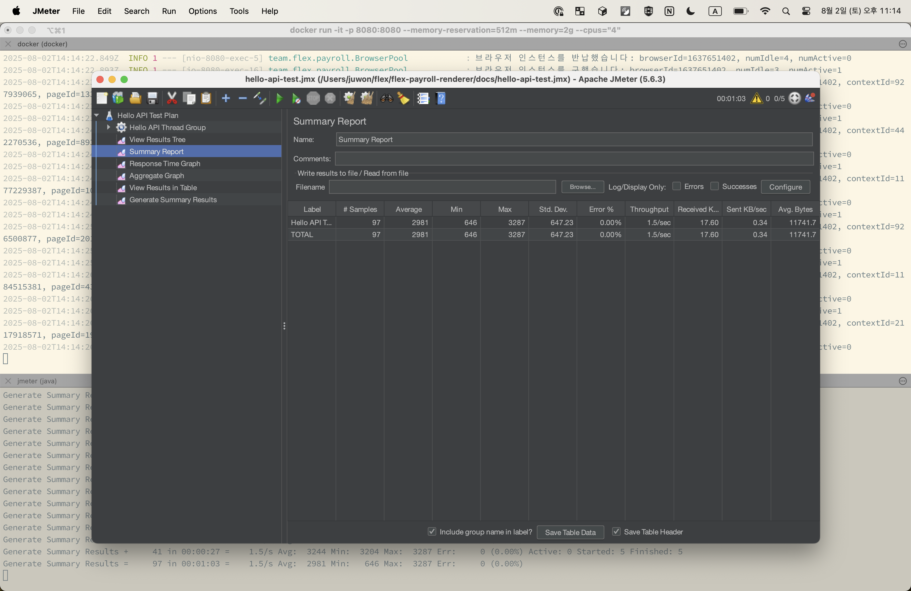

## flex-payroll-renderer

PAY-12961 pdf 렌더러 서버의 Kopring 포팅 가능성을 확인한다

핵심 작동 구조


- 템플릿은 frontend 폴더에 작성한다
- backend 빌드 시점에 frontend 빌드 아티팩트는 backend 정적 리소스 서빙 위치로 복사한다
- 애플리케이션이 구동되면
  - HelloController가 pdf 렌더링 api 요청을 받는다
  - PdfRender가 PlayWright를 구동하고, public 폴더에 위치한 index.html을 브라우저에서 렌더링한다
  - PlayWright는 렌더링된 html 페이지를 pdf 바이트 배열로 HelloController에 반환한다
  - HelloController가 pdf 파일을 응답한다

### Run frontend locally

```shell
$ ./gradlew runFrontend
# localhost:3000
```

### Run backend & frontend locally

```shell
$ ./gradlew bootRun
# localhost:8080
```

test

```shell
$ curl -H 'Content-type: application/json' -X POST http://localhost:8080/api/hello -d '{"name": "John"}' > ~/Desktop/hello.pdf
$ open ~/Desktop/hello.pdf
```

### Build docker

```shell
$ ./gradlew jibDockerBuild

$ docker image ls
# REPOSITORY                TAG
# flex-payroll-renderer     latest

$ docker run -it --rm -p 8080:8080 --memory-reservation=512m --memory=2g --cpus="4"  flex-payroll-renderer:latest
# memory min 512m / max 2g, cpu 4 cores
```

### TODO

- [x] Docker Image (JRE21 + PlayWright) -> see [Dockerfile](Dockerfile)
- [x] 단위 시간당 처리량 측정

  
  
  ```shell
  # build docker image
  $ ./gradlew jibDockerBuild
  
  # run docker container
  $ docker run -it --rm -p 8080:8080 --memory-reservation=512m --memory=2g --cpus="4"  flex-payroll-renderer:latest
  
  # run jmeter
  $ brew install jmeter
  $ jmeter -n -t ./docs/hello-api-test.jmx -l ./build/hello-api-test-result.csv -e -o ./build/test-reports
  
  # check test results
  $ open ./build/test-reports/index.html
  ```

- [x] Spring <-> PlayWright+index.html 간 더 나은 데이터 교환 방식 연구

  1) ~~index.html calls backend to fetch data~~ 폐기
  ```mermaid
  sequenceDiagram
      autonumber
      participant C as Client
      participant HTTP1 as Controller1
      participant SVC as Service
      participant CR as CommandRegistry
      participant PR as PdfRenderer
      participant PW as Playwright (headless browser)
      participant WEB as SPA index.html
      participant HTTP2 as Controller2
  
      C->>HTTP1: POST /api/hello
      activate HTTP1
      HTTP1->>SVC: render(Command)
      activate SVC
      SVC->>CR: put(UUID, Command)
      activate CR
      deactivate CR
      SVC->>PR: renderHtmlToPdf(UUID)
      activate PR
      PR->>PW: load Chromium
      activate PW
      PW->>WEB: open index.html?commandId=UUID
      activate WEB
      WEB->>HTTP2: GET /api/data?commandId=UUID
      activate HTTP2
      HTTP2->>SVC: findById(UUID)
      SVC-->>HTTP2: Command
      HTTP2->>WEB: JSON data
      deactivate HTTP2
      WEB->>WEB: render HTML
      deactivate WEB
      PW-->PW: render PDF From HTML
      PW-->>PR: pdf byte array
      deactivate PW
      PR-->>SVC: pdf byte array
      deactivate PR
      SVC->>CR: remove(UUID)
      activate CR
      deactivate CR
      SVC-->>HTTP1: pdf byte array
      deactivate SVC
      HTTP1-->>C: pdf file
      deactivate HTTP1
  ```

  2) Inject JSON data before the page loads
  ```mermaid
  sequenceDiagram
    autonumber
    participant C as Client
    participant HTTP as Controller
    participant PR as PdfRenderer
    participant PW as Playwright (headless browser)
    participant WEB as SPA index.html
  
    C->>HTTP: POST /api/hello
    activate HTTP
    HTTP->>PR: renderHtmlToPdf(Command)
    activate PR
    PR->>PW: load Chromium
    activate PW
    PR->>PW: JSONify Command & inject JSON
    PW->>WEB: open index.html
    activate WEB
    WEB->>WEB: render HTML
    deactivate WEB
    PW-->PW: render PDF From HTML
    PW-->>PR: pdf byte array
    deactivate PW
    PR-->>HTTP: pdf byte array
    deactivate PR
    HTTP-->>C: pdf file
    deactivate HTTP
  ```
